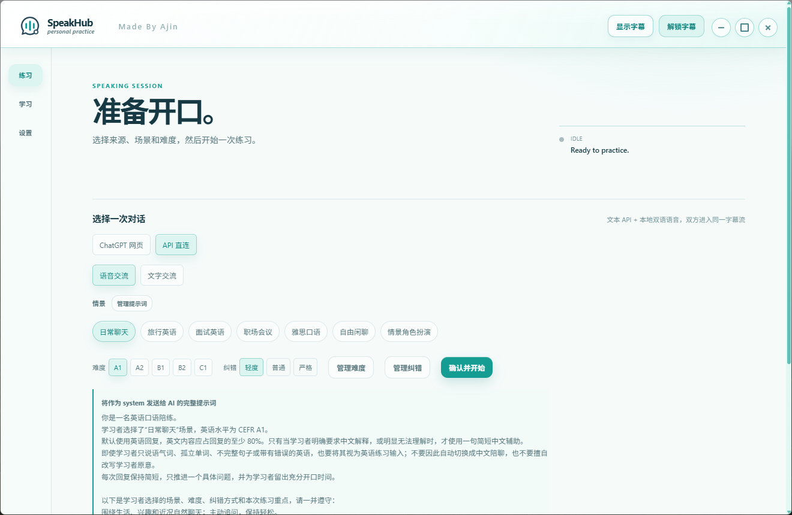
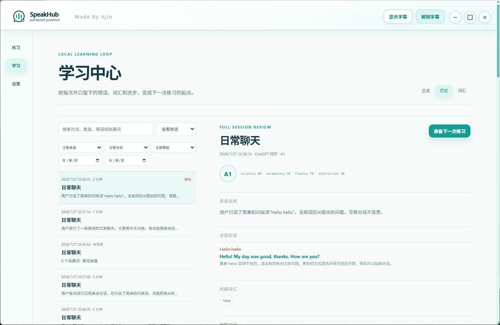
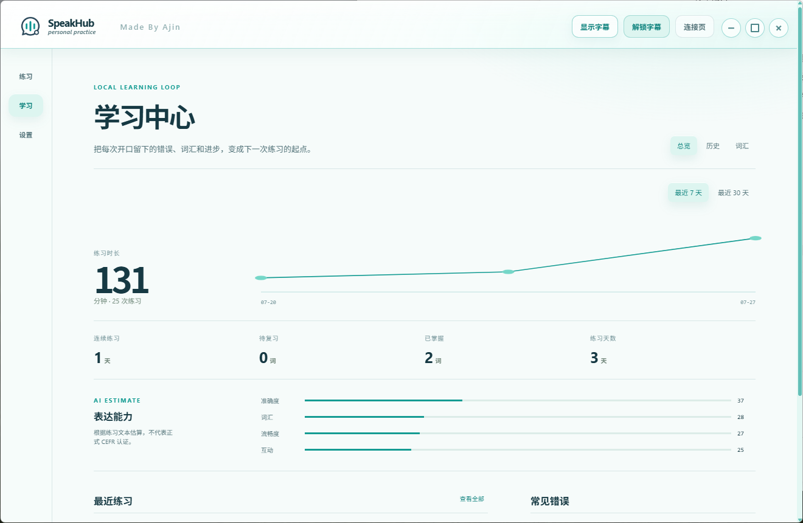
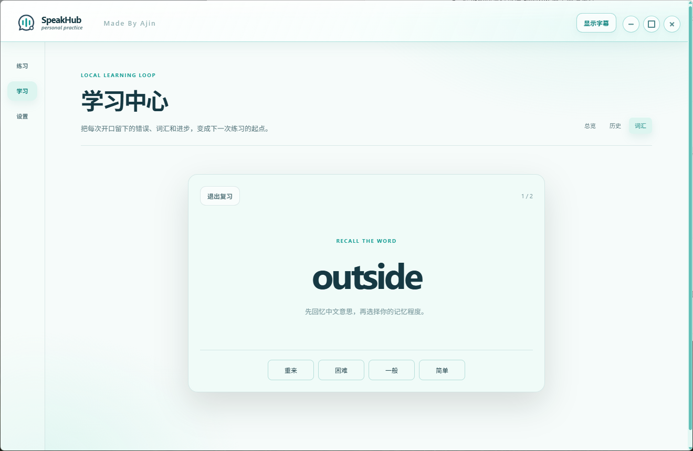

# SpeakHub

> 💬 **QQ 交流群：1091142340** ｜ 联系邮箱：[yinyizhen0416@163.com](mailto:yinyizhen0416@163.com)
>
> 欢迎加入群聊，一起分享 Vibe Coding 经验、交流 AI 工具，也可以反馈 SpeakHub 的问题和想法，大家一起学习、一起把项目做得更好。

[English](./README.en.md)

> ⬇️ **Windows 安装包：** [点击下载最新版（v0.2.0）](https://github.com/yin-yizhen/SpeakHub/releases/download/v0.2.0/SpeakHub-0.2.0-Setup.exe) ｜ [查看 Release](https://github.com/yin-yizhen/SpeakHub/releases/latest)

SpeakHub（项目代码名 SpeakSub）是一款面向 Windows 的 AI 英语口语练习工具。它把自由对话、实时字幕、查词收藏、练习复盘和词汇复习串成一条完整的学习链路，让每一次开口都能留下可以继续利用的学习记录。

## 注意事项：若想使用第三方api，必须安装到英文路径。

## 功能亮点

- **两种练习来源**：支持 ChatGPT 网页和 OpenAI-compatible API 直连。
- **语音与文字交流**：可按场景、CEFR 难度和纠错强度开始练习，也可以管理自己的提示词。
- **实时悬浮字幕**：同步展示双方内容，支持调整样式、拖动位置，以及点击英文单词查看释义并收藏。
- **完整练习复盘**：保存对话、纠错、总结、能力评估和下一次练习建议。
- **本地学习中心**：查看练习趋势、历史记录、常见错误和词汇掌握情况。
- **词汇复习**：把字幕中收藏的单词加入复习队列，根据熟悉程度安排后续练习。
- **语句复习**：大模型对句子进行分析复盘，保留常用句型及高级表达等。
- **可持续学习**：可将上一次复盘的薄弱点直接带入下一轮对话。

## 项目界面

### 1. 自定义一次英语练习

选择 ChatGPT 网页或 API 直连，设置语音/文字模式、对话场景、难度和纠错方式，然后开始练习。



### 2. 使用实时悬浮字幕和查词

悬浮字幕可以覆盖在其他窗口上方。点击英文单词即可查看音标和中文释义，并可进一步收藏。


### 3. 查看完整练习复盘

每次练习结束后，可以查看复盘总结、全部纠错、收藏词汇、完整对话和下一次练习建议。



### 4. 跟踪学习进度

学习中心会汇总练习时长、练习天数、词汇掌握情况和 AI 评估结果，帮助你看到长期变化。



### 5. 复习收藏词汇

通过词汇卡片主动回忆单词，并按“重来、困难、一般、简单”记录掌握程度。



## 工作方式

### ChatGPT 网页模式

登录 ChatGPT 后，由 SpeakHub 创建练习对话、发送提示词并捕获字幕。适合已经习惯使用 ChatGPT 网页语音或文字对话的用户。

### API 直连模式

使用 DeepSeek 或其他 OpenAI-compatible 文本接口生成回复和复盘。语音模式使用阿里云 Fun-ASR 识别声音，本地 Silero VAD 检测开口和打断，本地 Kokoro 负责 AI 朗读。

> API 直连模式需要使用你自己的 API Key，相关服务可能产生费用，请以服务商的实际计费规则为准。

## 快速开始

### 环境要求

- Windows 10/11
- Node.js
- pnpm

### 本地运行

```powershell
pnpm install
pnpm dev
```

也可以使用兼容的启动命令：

```powershell
pnpm run dev:electron
```

### 打包 Windows 安装程序

```powershell
pnpm package:win
```

生成结果位于 `release/`，正式安装包命名为 `SpeakHub-版本号-Setup.exe`。安装时可以选择目录，并可创建桌面和开始菜单快捷方式。


## 第一次使用

1. 打开“设置”，填写 OpenAI-compatible 接口的 Base URL、模型名和 API Key。
2. 如果使用 API 语音练习，再填写阿里云 DashScope API Key，并下载 VAD 与 Kokoro 语音组件。
3. 回到“练习”，选择来源、交流方式、场景、难度和纠错方式。
4. 点击“确认并开始”，需要时打开悬浮字幕。
5. 结束对话并生成复盘，之后可在“学习”中查看历史、趋势和词汇。

API Key 通过 Electron 提供的系统安全存储能力加密后保存在本机，不会写入项目仓库。

## 隐私说明

SpeakHub 默认启用最小化匿名使用统计，仅用于了解应用是否启动、运行大致多久以及版本使用情况。统计只在 Electron 主进程中发送，不读取练习内容。


</details>

## 开发与验证

```powershell
pnpm lint
pnpm test
pnpm build
pnpm package:win
```

## 反馈与交流

遇到问题、想到新功能，或者想交流 Vibe Coding 和 AI 学习方法，都欢迎加入 QQ 群 **1091142340**。反馈问题时，建议附上操作步骤、现象截图和使用模式，方便更快定位。

## 请我喝一杯咖啡 ☕

如果 SpeakHub 对你有帮助，欢迎请我喝一杯咖啡，或者赞助一点 Token，让项目可以继续测试更多模型和功能。

<p align="center">
  
</p>

无论是否赞助，都欢迎使用、分享和提出建议。你的真实使用反馈，就是这个项目持续完善的重要动力。
